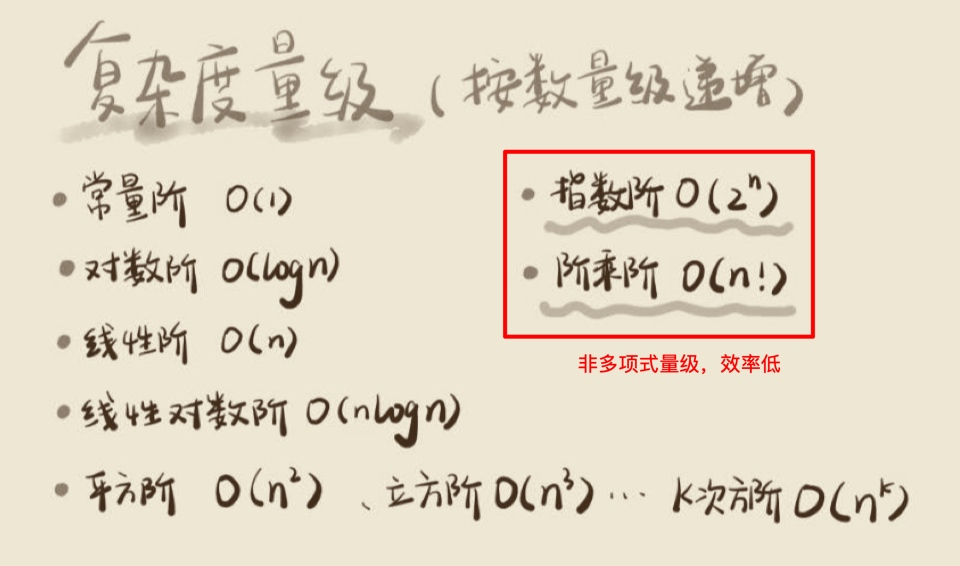
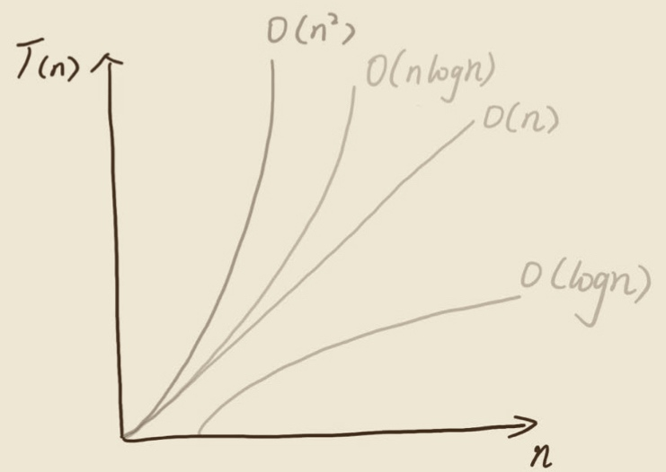

# 复杂度分析

## 为什么算法复杂度分析
传统测试为事后统计法，`依赖测试环境` & `数据规模`

## 大O复杂度表示法
**每次执行粗略定义时间相同，以运算次数作为时间复杂度的主要因素，成正比关系，渐进式复杂度**
`T(n) = O(f(n))`
`T(n)`: 执行时间；
`f(n)`: 代码执行次数总和；
低阶、常量、系数忽略；

## 时间复杂度分析
1. 只关注运行次数最多的一段代码；
2. 加法原则： 总复杂度等于量级最大的那段代码的复杂度；
3. 乘法原则： 嵌套代码的复杂度等于嵌套内外代码复杂度的乘积；

## 常见时间复杂度

## 空间复杂度
* 申请数组占用空间 O(n)

## 最坏、最好、平均、均摊时间复杂度
1. 最坏情况时间复杂度：代码在最理想情况下执行的时间复杂度。
2. 最好情况时间复杂度：代码在最坏情况下执行的时间复杂度。
3. 平均时间复杂度：用代码在所有情况下执行的次数的加权平均值表示。
4. 均摊时间复杂度：在代码执行的所有复杂度情况中绝大部分是低级别的复杂度，个别情况是高级别复杂度且发生具有`时序关系`时，可以将个别高级别复杂度均摊到低级别复杂度上。**基本上均摊结果就等于低级别复杂度。**