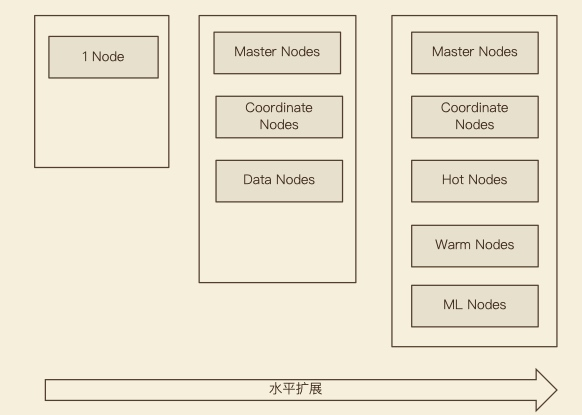
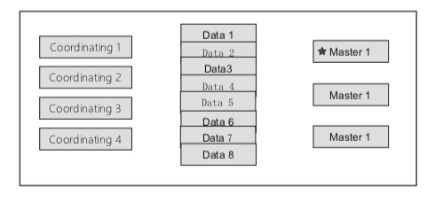
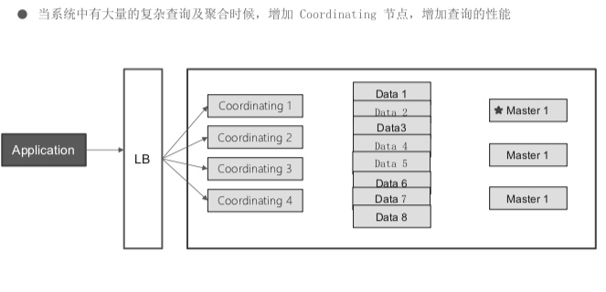
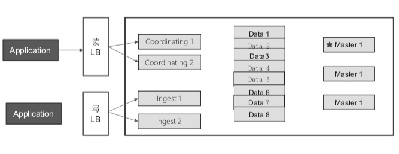
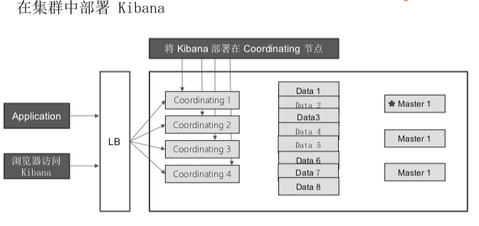
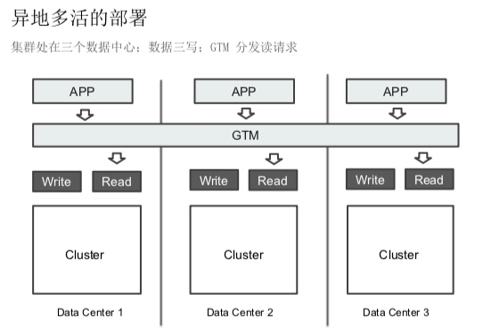

# 集群部署方式
## 测试环境部署及扩展

## 节点分类：
* master node & master-eligible node(master候选节点)
* data node & coordinating node(协调节点)
    * coordinating node: 接受client请求，分发请求到节点，汇聚结果；每个节点都起到corrdinating作用；
* hot node & warm node

## shard:
* shard数过少：
    * 无法扩容(master shard不可动态增加，只能reindex)
    * 但shard size过大，数据重分配耗时；
* shard数过大：
    * 影响相关score, 影响统计结果？
    * 但节点shard数过多，资源浪费、影响性能；

## 单一角色节点
* 节点类型

| Role | 备注 | node.master & node.ingest & node.data | 配置 |
| --- | --- | --- | --- | 
| Master Eligible | cluster state manager | true & false & false | 3 | 
| Data | data storage and deal client request | false & false & true | |
| Ingest | 数据处理 | false & true & false | |
| Coordinating | client node | false & false & false | oom |

## 基本部署

## 扩展

### 水平扩展

### 读写分离

### kibana高可用

### 异地多活

