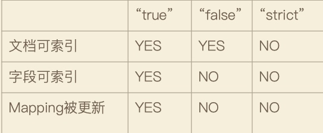

# Dynimac Mapping & 字段类型

## 字段类型
* 简单类型
    * text / keywork
    * Date
    * Integer / Floating
    * Boolean
    * ipv4 & ipv6

* 对象、嵌套对象

* 特殊类型
    * geo_point & geo_shape
    * percolator

    
## 能否更改Mapping的字段类型？
* 两种情况：
    * 增加字段
        * Dynamic = true, Mapping自动更新；
        * Dynamic = false, 不自动更新，新增字段无法被索引，信息出现在_source中；
        * Dynamic = Strict, 文档写入失败；

    * 已有字段，已经有数据写入，不允许修改
        * lucene倒排索引已经实现，不可修改

    * 如果希望改变字段类型，必须reindex api, 重建索引；

* 原因：
    * 修改了字段数据类型，导致已经创建的索引无法被搜索；
    * 增加新字段没有影响；

## 控制字段不被索引
”index“: false

## null_value
* 需要对null值实现搜索
    * ”null_values“: "NULL"
* 只有`Keywork`类型支持设定Null_Value;