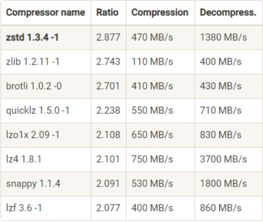

# 客户端实践及原理解析
> producer、consumer、broker结合使用原理

[toc]
## 生产者消息分区机制(Producer --> Partiton)
### why use partition?
* 负载均衡、读写增加性能；
* 灵活扩缩容；

### 分区策略(选择策略)
* **RR**: (未定义key default RR)轮询策略有非常优秀的负载均衡表现，它总是能保证消息最大限度地被平均分配到所有分区上，故默认情况下它是最合理的分区策略，也是我们最常用的分区策略之一。
* **Randomness**: 随机、(message % partition)趋于
* **Key-ordering**: 给message定义key, 并保证相同key进入同一个partition;
* **地理位置**: 

## Producer Compression
### how to compression
* v1: (<0.11.0) 多条message压缩
* v2: (>=0.11.0) message set 压缩 (避免每条消息CRC)

### when to compression
**Producer 端压缩、Broker 端保持、Consumer 端解压缩**
* 两种特殊情况除producer外，broker也会压缩：
    * Broker 端指定了和 Producer 端不同的压缩算法
    * Broker 端发生了消息格式转换
        * (new/old client version && 丧失zero copy)

### when to discompression
**consumer + broker**
Broker: 每个压缩过的消息集合在 Broker 端写入时都要发生解压缩操作，目的就是为了对消息执行各种验证

### Compression Algorithm PK


### Best Practice
权衡cpu & bandwidth资源, 是否使用压缩

#### issue
* [避免每条消息解压校验](https://issues.apache.org/jira/browse/KAFKA-8106)

## make message not miss
**kafka只对已提交的消息(committed message)做有限度的持久化保证**

已提交：
    1. broker返回已经提交信息(one broker or all broker);

有限度：
    1. 集群存活；

producer -1-> kafka(broker) -2-> consumer
1. **producer miss message**: 生产时，producer api使用含有`回调通知`的调用方法(fire and forget)
    producer.send(msg) or producer.send(msg, callback)
1. **consumer miss message**: 维持先消费消息，再更新位移的顺序(造成重复消费问题)
2. **comsumer multic process**: 如果是多线程异步处理消费消息，Consumer 程序不要开启自动提交位移，而是要应用程序手动提交位移;

``` yaml
# -- producer write --
不要使用 producer.send(msg)，而要使用 producer.send(msg, callback)。记住，一定要使用带有回调通知的 send 方法。

设置 acks = all。acks 是 Producer 的一个参数，代表了你对“已提交”消息的定义。如果设置成 all，则表明所有副本 Broker 都要接收到消息，该消息才算是“已提交”。这是最高等级的“已提交”定义。

设置 retries 为一个较大的值。这里的 retries 同样是 Producer 的参数，对应前面提到的 Producer 自动重试。当出现网络的瞬时抖动时，消息发送可能会失败，此时配置了 retries > 0 的 Producer 能够自动重试消息发送，避免消息丢失。

# -- broker keep --
设置 unclean.leader.election.enable = false。这是 Broker 端的参数，它控制的是哪些 Broker 有资格竞选分区的 Leader。如果一个 Broker 落后原先的 Leader 太多，那么它一旦成为新的 Leader，必然会造成消息的丢失。故一般都要将该参数设置成 false，即不允许这种情况的发生。

设置 replication.factor >= 3。这也是 Broker 端的参数。其实这里想表述的是，最好将消息多保存几份，毕竟目前防止消息丢失的主要机制就是冗余。

设置 min.insync.replicas > 1。这依然是 Broker 端参数，控制的是消息至少要被写入到多少个副本才算是“已提交”。设置成大于 1 可以提升消息持久性。在实际环境中千万不要使用默认值 1。

确保 replication.factor > min.insync.replicas。如果两者相等，那么只要有一个副本挂机，整个分区就无法正常工作了。我们不仅要改善消息的持久性，防止数据丢失，还要在不降低可用性的基础上完成。推荐设置成 replication.factor = min.insync.replicas + 1。

# -- comsumer read --
确保消息消费完成再提交。Consumer 端有个参数 enable.auto.commit，最好把它设置成 false，并采用手动提交位移的方式。就像前面说的，这对于单 Consumer 多线程处理的场景而言是至关重要的。
```

## client 高级功能
* Kafka 拦截器