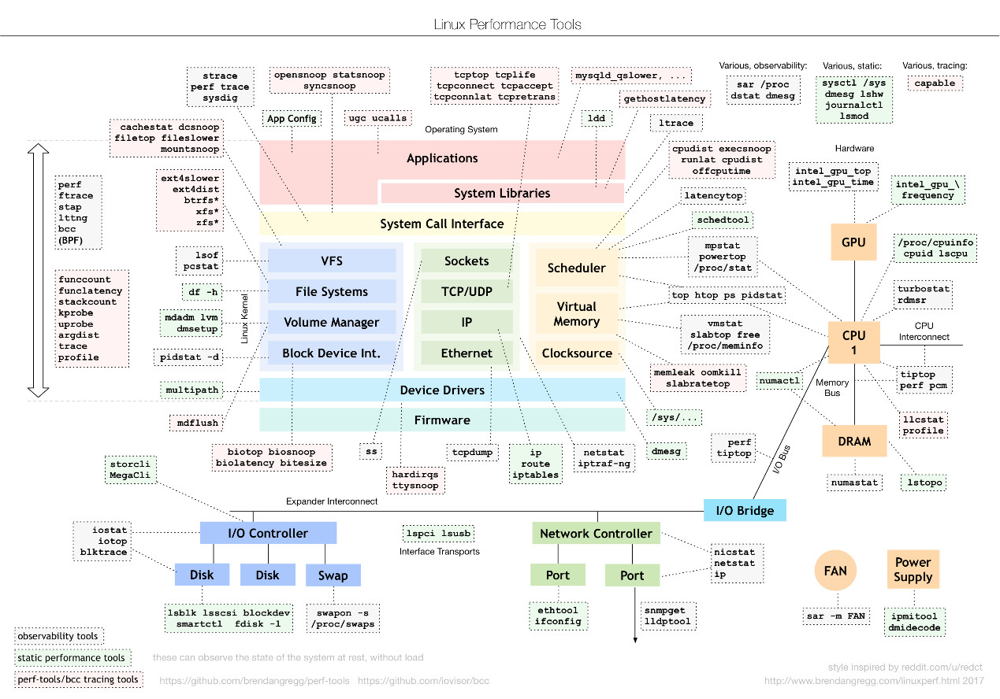

# Linux性能优化

**理解应用程序和系统的少数几个基本原理，实战练习，建立整体性能全局观；**
* 目标：
    * 理解系统知识原理
    * 掌握必要性能工具；
    * 实际场景、贯穿；

## 步骤
### 选择性能指标评估应用程序和系统的性能
* 应用程序指标：吞吐 & 并发
* 系统资源： 资源使用率 & 饱和度

### 设定性能目标

### 性能基准测试

### 分析性能定位瓶颈

### 优化系统、应用程序

### 性能监控、告警

## 工具
