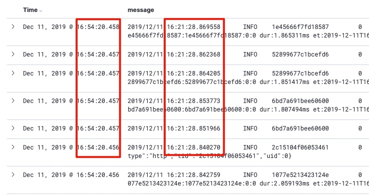

# Logstash 调优

## 问题描述

如图: filebeat push timestamp 整整比生成日志的时间差了半个小时，filebeat遇到性能瓶颈导致；

## 分析
* filebeat + logstash
> 这种是经常遇见的情况，大多数都是因为logstash消费慢，造成上述情况；

``` yaml
`filebeat`维护memory queue, (size: `queue.mem.events`最多缓存事件数)接收所有harvesters, 合并为batch内容；
`logstash` output 每次从queue中拿取`bulk_max_size` event;
单台logstash单work每次消费数据 = logstash.bulk_max_size * pipeline(并发数)
因此，logstash每秒可消费数据 = logstash.bulk_max_size * pipeline(并发数) * work_count * logstash_instance

比如：
logstash.work: 4
logstash.endpoint: 2
logstash.pipelining: 2
logstash.default.bulk_max_size: 2048
因此：
logstash.每次可消费： 32768
filebeat。queue.mem.events： 32768*2的event数(用于循环)
filebeat.event: 4096显然不够；

* filebeat + kafka + logstash
> 由于filebeat并非直接给logstash消费，直接可定位于filebeat本身性能问题；
```

* filebeat:

``` yaml
tail_files: false
close_inactive: 1h
ignore_older: 2h
  
# max_backoff意为两次扫描行等待时间的最大值，默认为10s。这是啥意思呢？不是已经设了backoff = 1s了吗？这里就涉及到EOF的问题。
# 当harvester读取到文件末尾时，它就不会再等backoff时间了，而是等待backoff * backoff_factor秒才进行下一次检测(backoff_factor默认为2)，直到达到mac_backoff为止。
# 也就是说，当读到EOF后，harvester会先等待2s再检测变化，如果没有新内容，则等待4s, 再没有新内容，等8s, 直到达到10s最大值为止。如果将backoff_factor设为1则意为关闭此特性。
# 这里如果对日志实时性要求较高，则最好把此参数设为1s, 或者将mac_backoff设为1s也能达到一样的效果。

max_backoff: 1s
backoff_factor: 1
```

## logstash
### 更改配置
* jvm.options

```
# 堆内存使用为节点内存的一半
-Xms8g
-Xmx8g
```

* logstash.yml

```
pipeline.batch.size: 10000
pipeline.workers: 16
pipeline.output.workers: 5


http.host: "10.46.59.64"
log.level: info
```
* pipeline.batch.size: The maximum number of events an individual worker thread will collect from inputs before attempting to execute its filters and outputs. Larger batch sizes are generally more efficient, but come at the cost of increased memory overhead. You may need to increase JVM heap space in the jvm.options config file. See Logstash Configuration Files for more info.(一个work处理进程处理前 从kafka收集的日志条数)
*  The number of workers that will, in parallel, execute the filter and output stages of the pipeline. If you find that events are backing up, or that the CPU is not saturated, consider increasing this number to better utilize machine processing power.(改成cpu核数)
*  pipeline.output.workers: 表示每个output插件实例使用的workers的数量，默认是1.
*  http.host: 改为本机IP，便于进行端口探测

### 衡量指标
* iftop: 之前看到RX >> TX, output.workers过小，接受过多，但发不出去了，logstash进程崩溃。

```
                          195Kb                     391Kb                     586Kb                     781Kb                977Kb
└─────────────────────────┴─────────────────────────┴─────────────────────────┴─────────────────────────┴─────────────────────────
localhost                                           => 172.16.16.34                                        40.3Kb  62.7Kb  61.3Kb
                                                    <=                                                     18.2Kb  17.2Kb  20.5Kb
localhost                                           => 172.16.16.36                                        43.5Kb  23.1Kb  23.1Kb
                                                    <=                                                     0.98Kb  1.07Kb  1.15Kb
localhost                                           => 10.66.1.4                                           1.62Kb  1.51Kb  1.41Kb
                                                    <=                                                      208b    208b    208b
vm172-16-16-31.ksc.com                              => 198.18.254.30                                          0b    205b     63b
                                                    <=                                                        0b    422b    152b
vm172-16-16-31.ksc.com                              => 120.92.212.184                                         0b      0b    268b
                                                    <=                                                        0b      0b     81b
localhost                                           => 172.16.16.73                                           0b      0b     17b
                                                    <=                                                        0b      0b     17b


──────────────────────────────────────────────────────────────────────────────────────────────────────────────────────────────────
TX:             cum:   1.16MB   peak:    226Kb                                                    rates:   85.4Kb  87.4Kb  86.1Kb
RX:                     317KB           65.9Kb                                                             19.3Kb  18.9Kb  22.1Kb
TOTAL:                 1.47MB            292Kb                                                              105Kb   106Kb   108Kb
---
TX：发送流量
RX：接收流量
TOTAL：总流量
Cumm：运行iftop到目前时间的总流量
peak：流量峰值
rates：分别表示过去 2s 10s 40s 的平均流量
```


* jstat

```
$ jstat -gcutil  26615 1000
  S0     S1     E      O      M     CCS    YGC     YGCT    FGC    FGCT     GCT
  4.33   0.00  91.31  72.04  79.26  73.07 130654 2511.388   619  290.157 2801.545
  0.00   3.73  13.46  72.04  79.26  73.07 130655 2511.402   619  290.157 2801.559
  0.00   3.73  63.58  72.04  79.26  73.07 130655 2511.402   619  290.157 2801.559
---
S0：幸存1区当前使用比例
S1：幸存2区当前使用比例
E：伊甸园区使用比例
O：老年代使用比例
M：元数据区使用比例
CCS：压缩使用比例
YGC：年轻代垃圾回收次数
FGC：老年代垃圾回收次数
FGCT：老年代垃圾回收消耗时间
GCT：垃圾回收消耗总时间


------------------
$ jstat -gc 26615 1000
 S0C    S1C    S0U    S1U      EC       EU        OC         OU       MC     MU    CCSC   CCSU   YGC     YGCT    FGC    FGCT     GCT
110720.0 110720.0 3964.4  0.0   886080.0 59091.1  7281088.0  5246091.2  97404.0 77207.2 15548.0 11360.7 130726 2512.337  619   290.157 2802.494
110720.0 110720.0 3964.4  0.0   886080.0 192566.0 7281088.0  5246091.2  97404.0 77207.2 15548.0 11360.7 130726 2512.337  619   290.157 2802.494
110720.0 110720.0 3964.4  0.0   886080.0 350110.0 7281088.0  5246091.2  97404.0 77207.2 15548.0 11360.7 130726 2512.337  619   290.157 2802.494
110720.0 110720.0 3964.4  0.0   886080.0 498904.0 7281088.0  5246091.2  97404.0 77207.2 15548.0 11360.7 130726 2512.337  619   290.157 2802.494
110720.0 110720.0 3964.4  0.0   886080.0 647758.3 7281088.0  5246091.2  97404.0 77207.2 15548.0 11360.7 130726 2512.337  619   290.157 2802.494
110720.0 110720.0 3964.4  0.0   886080.0 819765.2 7281088.0  5246091.2  97404.0 77207.2 15548.0 11360.7 130726 2512.337  619   290.157 2802.494
---
S0C   年轻代中第一个survivor（幸存区）的容量 (字节)
S1C   年轻代中第二个survivor（幸存区）的容量 (字节)
S0U   年轻代中第一个survivor（幸存区）目前已使用空间 (字节)
S1U   年轻代中第二个survivor（幸存区）目前已使用空间 (字节)
EC    年轻代中Eden（伊甸园）的容量 (字节)
EU    年轻代中Eden（伊甸园）目前已使用空间 (字节)
OC    Old代的容量 (字节)
OU    Old代目前已使用空间 (字节)
PC    Perm(持久代)的容量 (字节)
PU 	  Perm(持久代)目前已使用空间 (字节)
YGC   从应用程序启动到采样时年轻代中gc次数
YGCT  从应用程序启动到采样时年轻代中gc所用时间(s)
FGC   从应用程序启动到采样时old代(全gc)gc次数
FGCT  从应用程序启动到采样时old代(全gc)gc所用时间(s)
GCT   从应用程序启动到采样时gc用的总时间(s)

```

## reference
* https://discuss.elastic.co/t/filebeat-slow-improve-performance/144717/2
* https://www.jianshu.com/p/7c5b1b409e8c