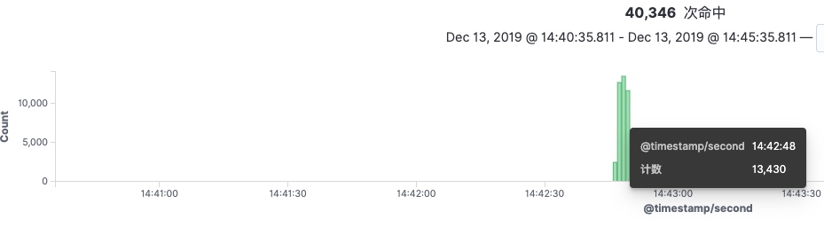
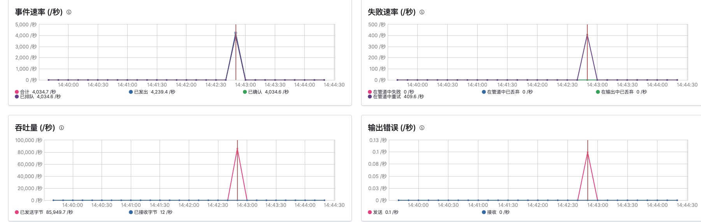
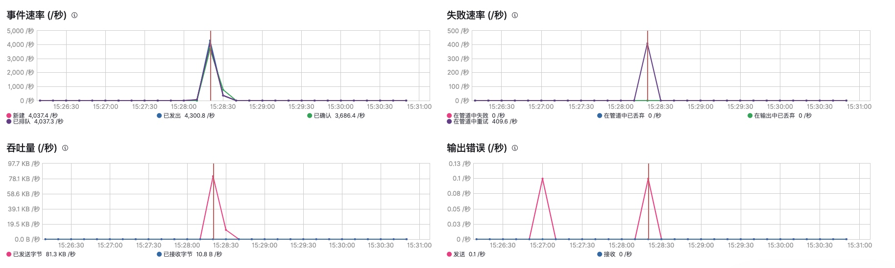
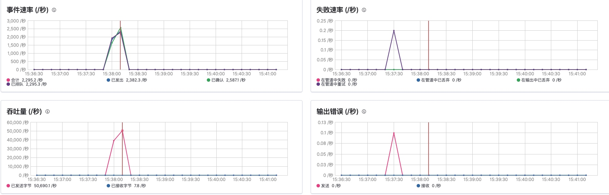
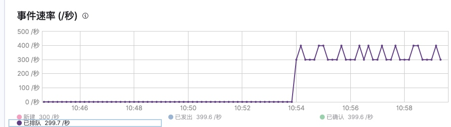
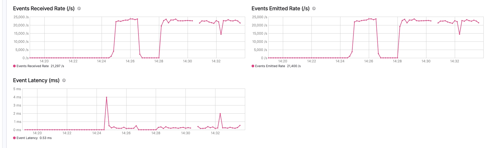
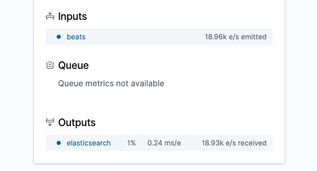
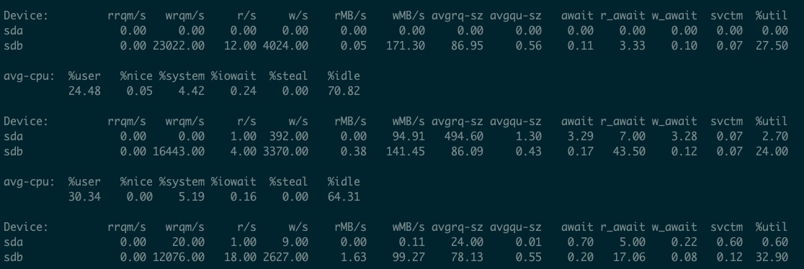

# 压测
> 使用docker-compose压测log全路径；

## 流程
filebeat --> kafka --> logstash --> es


## 压测filebeat性能
* filebeat使用默认配置；
* ab压测： `ab -c 1000 -n 50000 -t 30000 http://dyf.com:8888/`

### 参数无任何调整
并发1.3w





* kafak

``` yaml
kafka_bulk_max_size: 10000
kafka_channel_buffer_size: 2560
kafka_keep_alive: 10s
kafka_worker: 3
logging_output: kafka
```


* logstash

``` yaml
  worker: 3
  pipelining: 4
  bulk_max_size: 10000
```




* 将`bulk_max_size: 0` bulk size由filebeat internal决定，性能下降严重
    单纯增加 filebeat bulk size 没有用；



测试并发4,000k 是否峰值

* xx
worker: 3
pipelining: 4
bulk_max_size: 5000


-----
filebeat 默认队列 4048？每次发送200~300


## 压测数据1
400m/s -- 始终存在排队数据




时间速率：
1w/s 单文件 1.1w/s

加入不了队列延时等待；


filebeat 6.1
default 2.3w
增加logstash event received rate
增加filebeat event 







6.1
Mon Dec 16 14:53:20 CST 2019 -- start 2w
Mon Dec 16 14:56:52 CST 2019 -- stop 2w




Mon Dec 16 15:35:15 CST 2019 -- stop