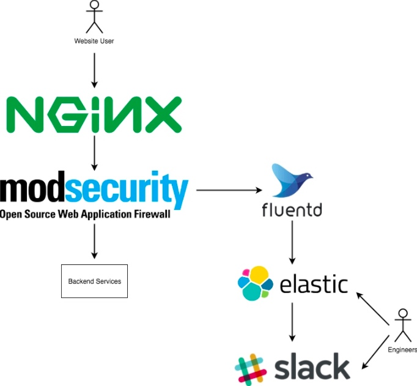

# Modsecurity
> 使用modsecurity实现waf;

## WAf总览

## Todo
* [x] openresty install modsecurity;
* [x] 针对modsecurity 产生的`nginx error log`进行、拆解；(生产环境不开启audit log,影响性能)；
* [x] ElastAlert调研、使用方式；异常访问，通过ElastAlert发出报警；
* [ ] 阻止攻击，kibana监控大盘；
* [ ] modsecurity规则的自定义；
    * owasp-modsecurity-crs-3.2.0 提供了完整的参考rules, 结合业务场景，不能全套使用，拆解规则；
    * 规则过多，reload时间长、内存消耗大；

## modsecurity规则自定义

